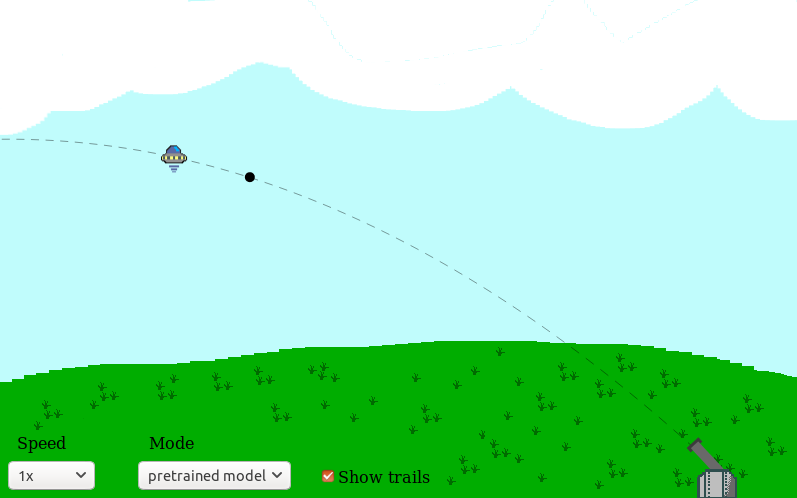
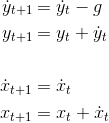

This is my first completely unguided machine learning project - defending Earth with neuroevolution.

**[Play the demo here](demo/index.html)**

Here, a neural network learns to solve a fire-control problem: How to hit a moving target with projectile motion.
Like many beginner ML problems, of course this could be solved analytically. I think it makes for a neat project though.

First, the game environment was created. This is:

 - The physics that affect projectiles
 - Building the gun and how it fires projectiles with a fixed speed at some angle.
 - Logic to determine if a projectie hits a target.

Projectiles follow frictionless projectile motion:

Next, the neural network is given control of the gun, and fed information from the game enviroment.
The neural network is dense (fully-connected) and has:
 - 4 Inputs: Target X-position, Target Y-Position, Target Speed, and a reload countdown.
 - A single hidden layer with 8 neurons.
 - 2 Outputs: Gun-angle, and Fire.

A population of guns is trialled one-by-one. Each gun is controlled by a (randomly initialised) neural network.
Performance is measured by how many UFOs are destroyed and how quickly. Near misses are also rewarded to encourage faster
training during early generations.

If a gun lets some UFOs through, it's killed-off and the next one takes its place. Once all the guns have been trialled,
a new generation is created. Better-performing guns are more likely to pass their genetics (NN) on to the next generation.
Small mutations may occur between generations.

There are a few options for the user:
- **train mode**: perform neuro-evolution on the guns
- **best so far**: display the best-performing gun that has been trained yet.
- **pretrained model**: deploy a pretrained, well-performing neural network.
- **manual**: take control of the gun yourself!

## References

 - [Toy Neural Network](https://github.com/CodingTrain/Toy-Neural-Network-JS) - The Coding Train
