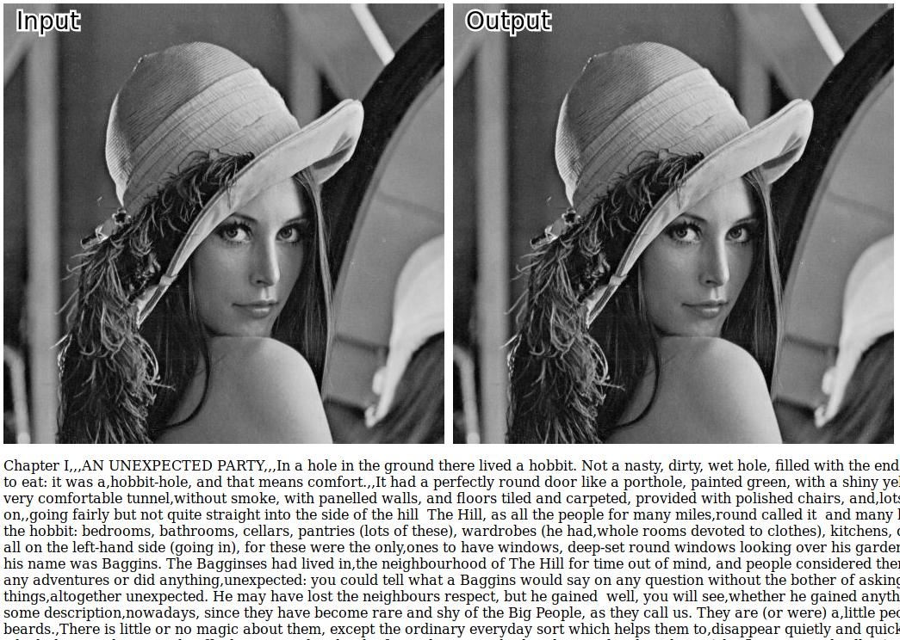

[Steganography](https://en.wikipedia.org/wiki/Steganography) is the practice of hiding secret data in plain sight. Here, about 23,000 words are hidden within a 512x512 black-and-white image, yet the image *appears unchanged*.

**[See the script run in your browser](demo/index.html)**

### Ok, so *how* are the words hidden?
The input text is a string, a stream of binary data. This data is distributed across the pixel data in the image.

Each pixel has a byte-value for Red, Green, Blue and Alpha (transparency). By replacing the least-significant bit in each of these bytes with bits from the input text, we can hide four bits of the message in each pixel. This does change how each pixel is displayed, but imperceptably to a casual observer.

Since there are 8bits in an ASCII character, this means two pixels are needed to hide the data for one character. At 512x512 pixels and 4 channels per pixel that means we have a capacity for (512x512*4) bits, or 131,072 characters. Apparently, on average there are 4.9 characters per word so we should be able to store about 26,500 words in the sample image. Pretty close to the actual count of about 23,000 - considering spaces and punctuation aren't counted in the theoretical number.

### References
 - Inspiration for this project came from watching [this video](https://www.youtube.com/watch?v=TWEXCYQKyDc) on [Computerphile](https://www.youtube.com/channel/UC9-y-6csu5WGm29I7JiwpnA)
